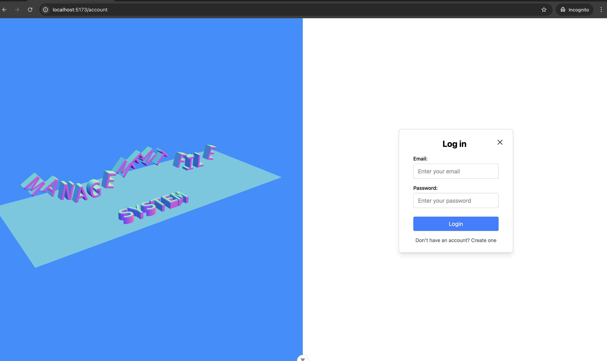
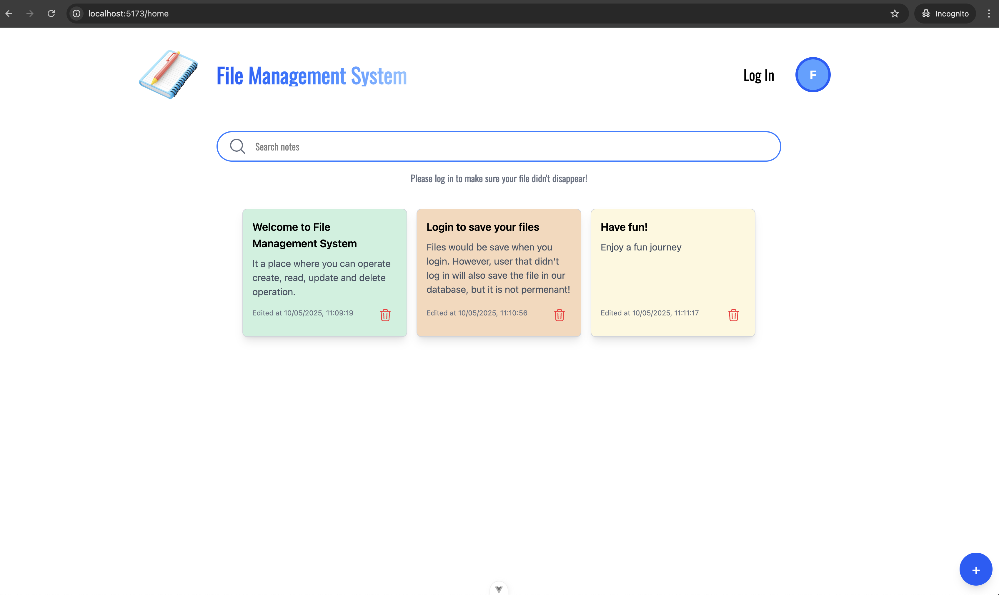

# Welcome to File Management System 📂

Welcome to the **File Management System**! This is the perfect place to securely store your files on the cloud. 🗄️

You can easily perform **CRUD** (Create, Read, Update, Delete) operations directly from our website. 🎉  
Enjoy the experience, and let us handle the files you need to remember. 💡

## Screenshots 📸

### Login Page 🔑

This is the login page where users can either sign in or sign up.  


### Main Page 📝

This is the main page where your notes and files are displayed.  


## How to Run ⚙️

1. Open your terminal and run the following command:

   ```bash
   ./main.sh

   ```

2. Open your browser and go to:
   http://localhost:5173

Let me know if you'd like any more edits.
